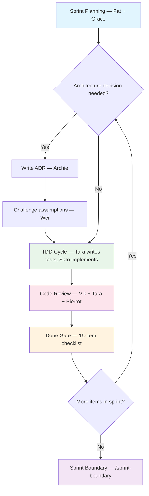

# vteam-hybrid

**A virtual development team for Claude Code and Codex.** One template. A team of specialists that enforces TDD, challenges architecture decisions, and gets smarter the more you use it.

> Claude Code is powerful, but on a real project it drifts. You ask it to implement a feature and it skips tests. You ask for architecture advice and it writes code instead. Reviews are inconsistent. Context evaporates between sessions.
>
> vteam-hybrid fixes this with 19 specialized agents — each with a defined role, clear boundaries, and rules about when they activate. You talk in natural language. The template handles the discipline.

---

## Quick Start

### 1. Create from template

Click **"Use this template"** on GitHub, or:

```bash
git clone <this-repo> my-project && cd my-project
rm -rf .git && git init && git add -A
git commit -m "chore: initialize from vteam-hybrid template"
```

**Validate:** `ls .claude/agents/` — you should see 19 agent files (18 personas + 1 composite reviewer).

### 2. Open in Claude Code

```bash
claude
```

### 2a. Or open in Codex

```bash
codex
```

Codex uses `AGENTS.md` directly. For workflow skills, this template treats `.claude/` as the source of truth and generates repo-local `.codex/` assets from it.

```bash
scripts/sync-codex-skills.sh
eval "$(scripts/codex-skills-env.sh activate)"
```

That does three things:

- Rebuilds `.codex/skills/` from `.claude/commands/`
- Mirrors `.claude/agents/` into `.codex/agents/`
- Temporarily overlays the repo's generated skills into your Codex skills directory

When you're done with the repo-local overlay:

```bash
deactivate_codex_skills
```

**Validate:** `ls .codex/skills/` should show generated `vteam-*` skills such as `vteam-plan` and `vteam-tdd`.

### 3. Scaffold your stack (optional)

| Command | What it sets up |
|---------|----------------|
| `/scaffold-cli` | Python or Rust CLI tool |
| `/scaffold-web-monorepo` | TypeScript monorepo (Next.js, React) |
| `/scaffold-ai-tool` | Python AI/ML tool (FastAPI, Streamlit) |
| `/scaffold-static-site` | Static site for GitHub Pages |

No scaffold fits? Skip this — the template works with any tech stack.

**Validate:** `ls docs/code-map.md` exists (moved from `docs/scaffolds/`).

### 4. Run discovery

**Fast path (~5 min):**
```
/quickstart I want to build <your project description>
```
Cam asks 3 questions, creates a backlog, and starts your first TDD cycle immediately. Best for getting started quickly — you can add the full methodology later.

**Full path (~30-60 min):**
```
/kickoff I want to build <your project description>
```
Five interactive phases: vision elicitation, product philosophy, design exploration, architecture with adversarial debate, and project board setup.

**Validate (quickstart):** CLAUDE.md has your project name, `docs/plans/quickstart-backlog.md` exists, and your first test is written.

**Validate (kickoff):** You should have `docs/product-context.md`, at least one ADR in `docs/adrs/`, and issues on your GitHub Projects board.

### 5. Start building

```
/tdd <feature-name>
```

Tara writes failing tests first. Sato makes them pass. Code review runs automatically with three parallel lenses.

**Validate:** A new test file, implementation code, and the issue moved to "In Review."

---

## How It Works

```
You:  I want to build a CLI tool that converts markdown to PDF

Cam:  Let me explore that with you. Who's the target user —
      developers or non-technical users? And what's your priority:
      fidelity to the markdown spec, or speed of conversion?

You:  Developers, and speed matters more than fidelity.

Cam:  Got it. Let me probe a few more things before we commit to
      an approach...
```

After discovery, the system hands off to Tara (failing tests) then Sato (implementation). You stay in control — the agents do the structured work.

**The five core agents** (always available):

| Agent | Role | When they activate |
|-------|------|--------------------|
| **Cam** | Vision and elicitation | When you describe a new idea or vague requirement |
| **Sato** | Implementation | When code needs to be written |
| **Tara** | Testing (TDD) | Before Sato — writes failing tests first |
| **Pat** | Product and priorities | When requirements need defining or priorities need setting |
| **Grace** | Tracking and coordination | When work needs to be organized or status tracked |

**Additional agents** activate when the work demands it — Archie for architecture, Vik for code review, Pierrot for security, Wei for devil's advocacy, Dani for design. You don't need to learn them upfront.

---

## What Makes This Different

- **TDD is enforced**, not suggested. Tara writes failing tests before Sato writes code.
- **Architecture decisions get challenged.** Archie proposes, Wei attacks. Structured debate, not rubber-stamping.
- **Security review is automatic.** Pierrot reviews every PR for vulnerabilities.
- **Context survives between sessions.** Agent-notes in every file mean Claude doesn't start from zero.
- **Sprint lifecycle is managed.** Grace tracks velocity, Pat manages the backlog, `/sprint-boundary` runs retros.

---

## Sprint Lifecycle

<!-- Text summary for accessibility: Plan (Pat + Grace) -> Architecture gate if needed (Archie + Wei debate) -> TDD cycle (Tara writes tests, Sato implements) -> Code review (Vik + Tara + Pierrot, three lenses) -> Done Gate (15-item checklist) -> repeat or sprint boundary -->



---

## All Commands

| Command | Description |
|---------|-------------|
| `/quickstart` | Fast 5-min onboarding: 3 questions, backlog, first TDD cycle |
| `/kickoff` | Full discovery workflow with board setup (30-60 min) |
| `/plan` | Create an implementation plan for a feature |
| `/tdd` | TDD workflow: Tara writes failing tests, Sato implements |
| `/code-review` | Three-lens code review (simplicity, tests, security) |
| `/review` | Guided human review/walkthrough session |
| `/design` | Explore design concepts with Dani |
| `/adr` | Create a new Architecture Decision Record |
| `/sprint-boundary` | Sprint retro, backlog sweep, next sprint setup |
| `/handoff` | Save session state for next session |
| `/resume` | Pick up from a previous session's handoff |
| `/retro` | Kaizen retrospective with GitHub issues |
| `/scaffold-cli` | Scaffold a CLI project (Python/Rust) |
| `/scaffold-web-monorepo` | Scaffold a web/mobile monorepo (TypeScript) |
| `/scaffold-ai-tool` | Scaffold an AI/data tool (Python) |
| `/scaffold-static-site` | Scaffold a static site (GitHub Pages) |
| `/restack` | Re-evaluate tech stack choices |
| `/pin-versions` | Pin dependency versions, update SBOM |
| `/sync-template` | Reapply template evolutions to in-flight repo |
| `/devcontainer` | Set up a dev container |
| `/sync-ghcp` | Sync agents to GitHub Copilot format |
| `/aws-review` | AWS deployment readiness review |
| `/azure-review` | Azure deployment readiness review |
| `/gcp-review` | GCP deployment readiness review |
| `/cloud-update` | Refresh cloud service landscape research |
| `/doctor` | Run 8 diagnostic checks on project setup |
| `/whatsit` | Explain a technology or concept (scout mode) |

---

## Using With Codex

The Codex workflow is intentionally single-source:

- Edit `.claude/commands/` and `.claude/agents/`
- Regenerate `.codex/` from those files
- Activate the repo-local Codex skill overlay when working in this repo

### Why this design

Codex and Claude organize reusable behavior differently. To avoid maintaining the same workflow in two places, this template keeps the authored versions in `.claude/` and generates Codex-friendly wrappers into `.codex/`.

### Recommended loop

```bash
# after changing .claude commands or agents
scripts/sync-codex-skills.sh

# when starting work in this repo
eval "$(scripts/codex-skills-env.sh activate)"

# when leaving the repo-local overlay
deactivate_codex_skills
```

### Files involved

```text
.claude/commands/              # source of truth for workflows
.claude/agents/                # source of truth for persona briefs
.codex/skills/                 # generated Codex skill adapters
.codex/agents/                 # generated links to persona briefs
scripts/sync-codex-skills.sh   # rebuild .codex from .claude
scripts/codex-skills-env.sh    # activate/deactivate repo-local Codex overlay
```

### Notes

- `.codex/` is generated. Prefer editing `.claude/` unless you are changing the export mechanism itself.
- `scripts/codex-skills-env.sh` restores conflicting installed skills on deactivation, similar to a lightweight virtualenv.
- If you only want a one-way install instead of an overlay, use `scripts/load-codex-skills.sh`.

---

## What Gets Created

```
.
├── CLAUDE.md                 # Runtime instructions for Claude Code
├── AGENTS.md                 # Runtime instructions for Codex
├── docs/
│   ├── methodology/          # System docs (phases, personas, agent-notes)
│   ├── process/              # Governance, done gate, gotchas
│   ├── integrations/         # Tracking adapters (GitHub Projects, Jira)
│   ├── adrs/                 # Architecture Decision Records
│   └── template-guide.md     # Deep-dive reference and customization guide
├── .codex/
│   ├── skills/               # Generated Codex skill adapters from .claude/commands
│   └── agents/               # Generated links to .claude/agents
├── .claude/
│   ├── agents/               # 19 agent definitions (18 personas + 1 composite)
│   └── commands/             # 27 workflow commands
└── scripts/                  # Automation scripts
```

Directories like `docs/plans/`, `docs/sprints/`, `docs/tracking/`, and `docs/security/` are created automatically by commands when first needed.

---

## Samples

See what the methodology produces before committing to it:

| Sample | Demonstrates | Time |
|--------|-------------|------|
| [hello-tdd/](samples/hello-tdd/) | Core TDD workflow (Tara writes tests, Sato makes them pass) | ~5 min |
| [architecture-debate/](samples/architecture-debate/) | Architecture Gate (Archie proposes, Wei challenges) | ~5 min |
| [full-sprint/](samples/full-sprint/) | Complete sprint lifecycle (plan, TDD, review, retro) | ~10 min |

---

## Going Deeper

| Doc | Time | What you'll learn |
|-----|------|-------------------|
| [Template Guide](docs/template-guide.md) | 5 min | Customization, scaling, full command reference |
| [Phases (TL;DR)](docs/methodology/phases.md#tldr) | 2 min | The 7 phases at a glance |
| [Phases (full)](docs/methodology/phases.md) | 10 min | How each phase works, who participates |
| [Personas](docs/methodology/personas.md) | skim | The 19-agent roster, capabilities, tiers |

---

## Replace This README

This README is automatically replaced during `/quickstart`, `/kickoff`, or any `/scaffold-*` command. See [Template Guide](docs/template-guide.md) for the full reference.
