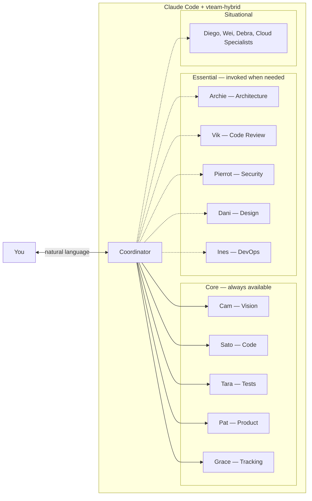
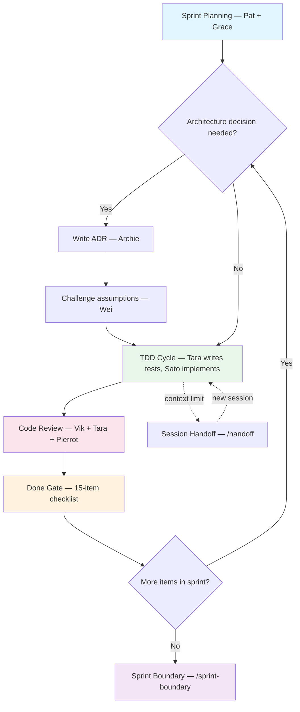

# vteam-hybrid Template Guide

## Why This Exists

Claude Code is powerful, but on a real project it drifts. You ask it to implement a feature and it skips tests. You ask for architecture advice and it writes code instead. Reviews are inconsistent. Context evaporates between sessions.

vteam-hybrid fixes this by giving Claude Code a structured team of specialized agents — each with a defined role, clear boundaries, and rules about when they activate. You talk in natural language. The template handles the discipline.

```
You:  I want to build a CLI tool that converts markdown to PDF

Cam:  Let me explore that with you. Who's the target user —
      developers or non-technical users? And what's your priority:
      fidelity to the markdown spec, or speed of conversion?

You:  Developers, and speed matters more than fidelity.

Cam:  Got it. Let me probe a few more things before we commit to
      an approach...
```

After discovery, you run `/tdd add-pdf-export` and the system hands off to Tara (who writes failing tests) and then Sato (who makes them pass). You stay in control — the agents do the structured work.

**The result:** TDD actually happens. Architecture decisions get challenged before code is written. Security review is automatic. And when you start a new session, agent-notes in every file mean Claude doesn't start from zero.

## Who This Is For

- **Solo developers** using Claude Code who want structured discipline without a team. The agents provide the rigor — TDD, code review, security audit — that a solo dev usually skips.
- **Small teams (2-3 people)** who want Claude Code to handle the process overhead so humans can focus on product decisions.
- **Anyone starting a new project** who wants to avoid the blank-canvas problem — the template gives you a working workflow from day one.

## What's Included

1. **18 specialized agent personas** — you only need to know 5 to start (the rest activate automatically when the work demands it)
2. **A phase-adaptive methodology** that changes who's involved based on whether you're exploring, building, or reviewing
3. **Agent-notes** — structured metadata at the top of every file so Claude remembers context between sessions
4. **24 command workflows** covering the full development lifecycle (`/kickoff`, `/tdd`, `/code-review`, etc.)
5. **Integration adapters** for GitHub Projects, Jira, and other tracking tools
6. **Cloud specialist agents** that adapt to AWS, Azure, or GCP

## Getting Started

### 1. Create a Repo from This Template

Click **"Use this template"** on GitHub, or clone and reinitialize:

```bash
git clone <this-repo> my-project
cd my-project
rm -rf .git
git init
git add -A
git commit -m "chore: initialize from vteam-hybrid template"
```

### 2. Scaffold Your Tech Stack

Run one of the scaffold commands to set up your project structure:

| Command | What it sets up |
|---------|----------------|
| `/scaffold-cli` | Python or Rust CLI tool |
| `/scaffold-web-monorepo` | TypeScript monorepo (Next.js, React, etc.) |
| `/scaffold-ai-tool` | Python AI/ML tool (FastAPI, Streamlit, etc.) |
| `/scaffold-static-site` | Static site for GitHub Pages |

No scaffold fits? You can skip this step and configure manually — the template works with any tech stack.

### 3. Run Discovery

Use `/kickoff` to run the discovery workflow. Cam (the vision agent) will ask you questions about your project, Pat (product) will help prioritize, and Grace (tracking) will set up your project board.

### 4. Start Building

Use `/tdd <feature>` for each piece of work. The template enforces test-driven development: Tara writes failing tests first, then Sato writes the implementation to make them pass.

## How It Works

You talk to Claude Code normally. The template's CLAUDE.md file teaches Claude when to invoke each agent based on what phase your work is in.

**The five core agents** (always available):

| Agent | Role | When they activate |
|-------|------|--------------------|
| **Cam** | Vision and elicitation | When you describe a new idea or vague requirement |
| **Sato** | Implementation | When code needs to be written |
| **Tara** | Testing (TDD) | Before Sato — writes failing tests first |
| **Pat** | Product and priorities | When requirements need defining or priorities need setting |
| **Grace** | Tracking and coordination | When work needs to be organized or status tracked |

**Additional agents** are invoked when the work demands it — Archie for architecture decisions, Vik for code review, Pierrot for security, Dani for design and accessibility, Ines for DevOps. You don't need to learn them upfront; they appear when relevant.

<!-- Text summary for accessibility: The system has three tiers. Five core agents (Cam, Sato, Tara, Pat, Grace) are always available. Five essential agents (Archie, Vik, Pierrot, Dani, Ines) are invoked when the work requires architecture, review, security, design, or infrastructure decisions. Additional situational agents (Diego for docs, Wei for devil's advocacy, Debra for data science, cloud specialists) activate for specialized needs. -->



## Sprint Lifecycle

A typical development cycle follows this flow. Each step names the agent responsible.

<!-- Text summary for accessibility: The sprint starts with planning (Pat prioritizes, Grace sets up the board). If an architecture decision is needed, Archie writes an ADR and Wei challenges it. Then the TDD cycle begins: Tara writes failing tests, Sato makes them pass and refactors. Code review follows with three parallel lenses (Vik for simplicity, Tara for test coverage, Pierrot for security). Work passes through a Done Gate checklist. If more items remain, the cycle repeats. When the sprint is complete, run /sprint-boundary for retrospective and next sprint planning. If context runs low mid-sprint, /handoff saves state for a new session. -->



## Key Concepts

If you encounter unfamiliar terms in the docs, here's a quick reference:

| Term | What it means |
|------|---------------|
| **Agent** | A Claude Code subagent with a specific role and personality (e.g., Tara only writes tests, never implementation code) |
| **TDD (Test-Driven Development)** | Write a failing test first, then write code to make it pass, then refactor. The template enforces this order. |
| **ADR (Architecture Decision Record)** | A short document explaining why you chose one approach over another. Archie writes these before major implementation work. |
| **Agent-notes** | Metadata at the top of every file (`ctx`, `deps`, `state`, `last`) so Claude can quickly understand any file without reading the whole thing. |
| **Sprint boundary** | The ceremony between sprints: retrospective, backlog cleanup, and planning for the next sprint. |
| **Done Gate** | A 15-item checklist every work item must pass before it's considered done (tests pass, review complete, docs updated, etc.). |

## File Map

| Path | Purpose |
|------|---------|
| `CLAUDE.md` | Runtime instructions for Claude Code — the entry point |
| `docs/methodology/` | System docs (phases, personas, agent-notes spec) |
| `docs/process/` | Governance, done gate, gotchas, tracking protocol, doc ownership |
| `docs/integrations/` | Tracking adapters (GitHub Projects, Jira) |
| `docs/scaffolds/` | Project stub docs (deployed to final locations during scaffold/kickoff) |
| `docs/adrs/` | Architecture Decision Records |
| `docs/adrs/template/` | Template-specific ADRs (removed during scaffold) |
| `docs/research/` | Cloud landscape files and research |
| `docs/media/` | Images and visual assets |
| `.claude/agents/*.md` | 18 runnable agent definitions |
| `.claude/commands/*.md` | 24 workflow commands |

Directories like `docs/code-reviews/`, `docs/plans/`, `docs/sprints/`, `docs/tracking/`, `docs/sbom/`, `docs/security/`, and `docs/runbooks/` are created automatically by commands when first needed — they don't exist in the template.

## Command Reference

All commands are invoked as `/<name>` in Claude Code (e.g., `/kickoff`, `/tdd`).

### Lifecycle

| Command | Description |
|---------|-------------|
| `quickstart` | Fast 5-min onboarding: 3 questions, backlog, first TDD cycle |
| `kickoff` | Full discovery workflow with board setup (30-60 min) |
| `plan` | Create an implementation plan for a feature |
| `tdd` | TDD workflow: Tara writes failing tests, Sato implements |
| `code-review` | Three-lens code review (simplicity, tests, security) |
| `review` | Guided human review/walkthrough session |
| `sprint-boundary` | Sprint retro, backlog sweep, next sprint setup |
| `handoff` | Save session state for the next session to resume |
| `resume` | Pick up from a previous session's handoff |
| `retro` | Kaizen retrospective with GitHub issues for findings |

### Design & Architecture

| Command | Description |
|---------|-------------|
| `design` | Explore design concepts with Dani before committing to an approach |
| `adr` | Create a new Architecture Decision Record |
| `restack` | Re-evaluate tech stack choices |

### Scaffolding

| Command | Description |
|---------|-------------|
| `scaffold-cli` | Scaffold a CLI project (Python/Rust) |
| `scaffold-web-monorepo` | Scaffold a web/mobile monorepo (TypeScript) |
| `scaffold-ai-tool` | Scaffold an AI/data tool (Python) |
| `scaffold-static-site` | Scaffold a static site (GitHub Pages) |

### Maintenance

| Command | Description |
|---------|-------------|
| `pin-versions` | Pin dependency versions, update SBOM |
| `sync-template` | Reapply template evolutions to an in-flight repo |
| `devcontainer` | Set up a dev container for any stack |
| `sync-ghcp` | Sync agent definitions to GitHub Copilot format |

### Cloud

| Command | Description |
|---------|-------------|
| `aws-review` | AWS deployment readiness review |
| `azure-review` | Azure deployment readiness review |
| `gcp-review` | GCP deployment readiness review |
| `cloud-update` | Refresh cloud service landscape research |

## Customization Guide

### Adding a New Agent

1. Create `.claude/agents/<name>.md` with proper frontmatter (see existing agents for format)
2. Add the agent to `docs/methodology/personas.md`
3. Update `docs/methodology/phases.md` with the agent's phase participation

### Modifying an Existing Agent

Edit the agent file directly. Update `last` in its agent-notes. If the change affects phase participation, update `docs/methodology/phases.md`.

### Adding a New Command

Create `.claude/commands/<name>.md` with an agent-notes HTML comment as the first line. Commands are auto-discovered by Claude Code.

### Switching Tracking Tools

See `docs/integrations/README.md` for how to switch between GitHub Projects, Jira, or other adapters.

### Scaling Up or Down

- **Solo / small project:** Collapse further. Sato absorbs Ines's infra work. The code-reviewer command covers all review. Pat handles all planning.
- **Medium project (2-3 teams):** Full roster. Grace earns her keep with cross-team coordination.
- **Large project (4+ teams):** Every role is distinct. Consider splitting consolidated agents back into specialists.

## Learning Path

Read in this order. Stop when you have enough:

| # | Doc | Time | What You'll Learn |
|---|-----|------|-------------------|
| 1 | This guide | 5 min | What's included, how to get started |
| 2 | [Phases (TL;DR)](methodology/phases.md#tldr) | 2 min | The 7 phases at a glance |
| 3 | [Phases (full)](methodology/phases.md) | 10 min | How each phase works, who participates |
| 4 | [Personas](methodology/personas.md) | skim | The 18-agent roster, capabilities, tiers |
